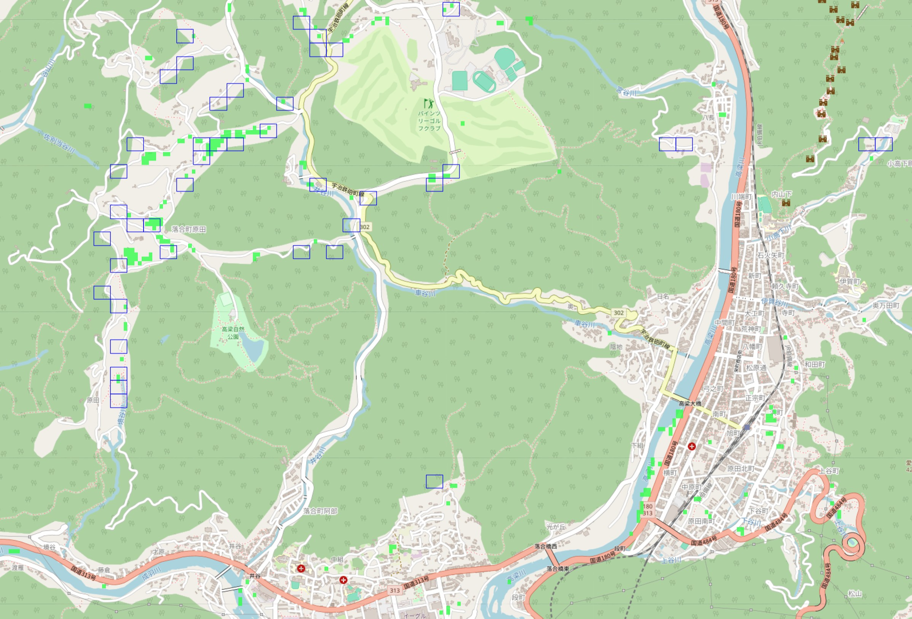
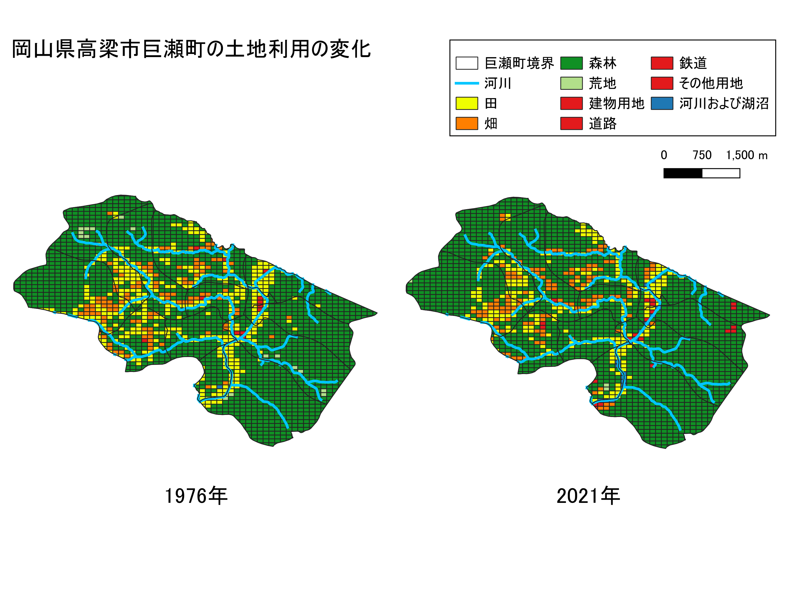
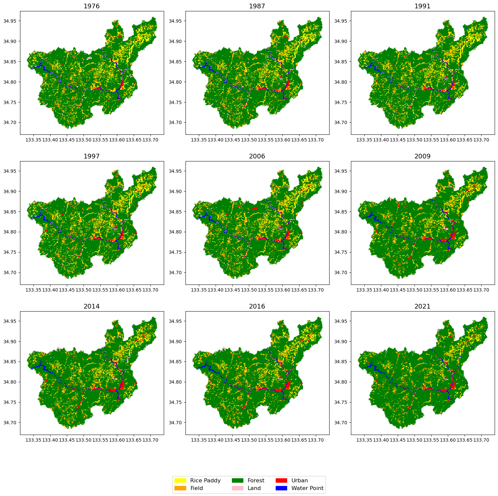
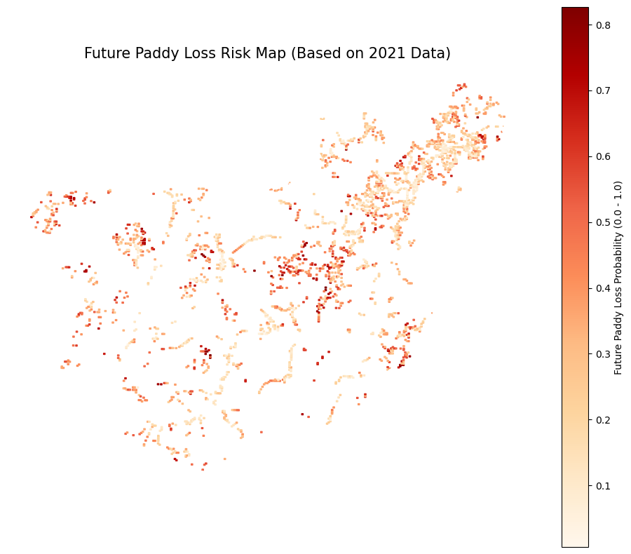
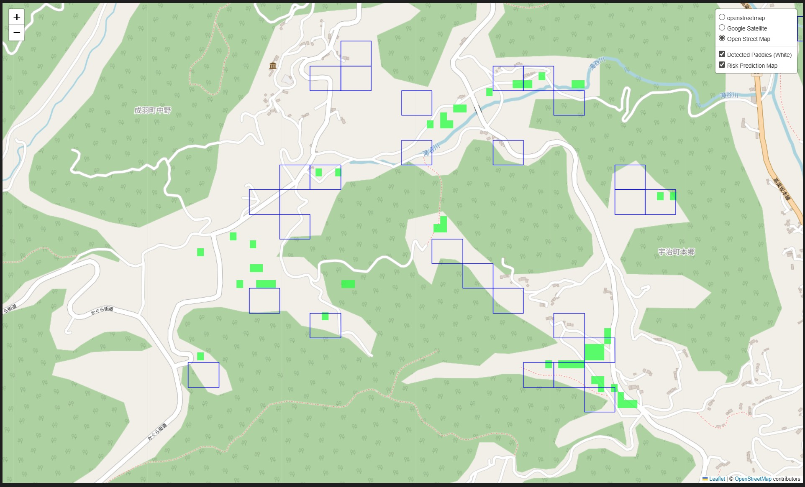

# README (JPN)

# 岡山県高梁市巨瀬町の水田消失から見る生物多様性損失リスク

 

## Index
- [1. Abstract](#1.-abstract)
- [2. Motivation](#2.-motivation)
- [3. Methodology & Works](#3.-methodology-&-works)
    - [3.1 Dataset](#3.1-dataset)
    - [3.2 Process](#3.2-process)
- [4. Result](#4.-result)
- [5. Nature Positive Social Implementation](#5.-nature-positive-social-implementation)
- [6. Future Work](#6.-future-work)
- [7. Environment](#7.-environment)
- [8. Usage](#8.-usage)
    - [8.1 Structure](#8.1-structure)
    - [8.2 Docker Environment](#8.2-docker-environment)

## 1. Abstract
生物多様性分野及び衛星データ活用の技術素養取得のための個人プロジェクト。\
岡山県高梁市巨瀬町の水田の減少の様子を1976年から2021年の期間で地図化。\
水田損失リスク予測マップをランダムフォレストでの学習を用いて作成し、テストデータによる評価および衛星データから取得したNDVI画像を暫定的な正解として妥当性評価を行った。

<figure>
  
</figure>

## 2. Motivation

岡山県高梁市巨瀬町は私talltomuraの祖父が住んでいた土地であり、自然豊かな土地であった。
幼少の頃は、休みの度に巨瀬町を訪れ、自然の中で過ごしていた。
水田が多い関係もあり、カエルやドジョウ、ヤゴやゲンゴロウなど、両生類をはじめ水生昆虫が多く生息していた。
しかし、子供時代から大人になるにつれ、巨瀬町に訪れる度に小さな生き物の数が減っていることに気づいた。
水田の隣を流れる水路からも生き物は姿を消し、そもそも農村の風景が巨瀬町、そして高梁市から消えているように感じた。

日本において、里山の暮らしによって維持される、農村風景は生物多様性を構成する重要な要素になっており、
水田や畑が耕作放棄地へと変化することにより生物多様性損失のリスクが発生する。\
[里山の生物多様性についての参考情報はこちら。](https://www.nies.go.jp/whatsnew/20170630/20170630.html)

私がこれまで「なんとなく」で感じていた生物の消失はおそらく水田の消失が原因であると考え、
**衛星データ活用やGISデータの活用の学習**として、高梁市の水田の消失について分析を行った。

<figure>
  
  <figcaption>QGISで作成した1976年vs2021年の岡山県高梁市巨瀬町の土地利用図</figcaption>
</figure>

## 3. Methodology & Works

### 3.1 Dataset
分析において以下のデータセットを用いた。

- **地理空間ファイル**
    - [国土数値情報ダウンロードサイト](https://nlftp.mlit.go.jp/ksj/gml/datalist/KsjTmplt-L03-b-2021.html)より取得
        - 1976年・1987年・1991年・1997年・2006年・2009年・2014年・2016年・2021年の岡山県の土地利用マップ
    - [岡山県高梁市の境界データ(2022年)](https://www.e-stat.go.jp/gis/statmap-search?page=1&type=2&aggregateUnitForBoundary=A&toukeiCode=00200521&toukeiYear=2020&serveyId=A002005212020&prefCode=33&coordsys=1&format=shape&datum=2000)
    - [河川データ(平成20年度岡山県世界測地系)](https://nlftp.mlit.go.jp/ksj/gml/datalist/KsjTmplt-W05.html)

    -[国土地理院発行のデジタル標高モデル](https://service.gsi.go.jp/kiban/app/map/?search=dem#10/34.81770905501085/133.81041047232554)

- **衛星データ**
    - Google Earth EngineのAPIをNotebookに接続して使用。
    - NDVI(Normalized Difference Vegetation Index)画像の取得のためにSentinel衛星の画像データを使用した。

### 3.2 Process 

本プロジェクトでは以下のプロセスで分析を行った。

1. **土地利用データの可視化 (QGIS / Python)**
    - 国土数値情報のデータを読み込み、QGISおよびPython (GeoPandas) で可視化。(QGISでの可視化についてはここでは解説しない)
    - 年代によって異なる土地利用コードを統一基準（水田、畑、森林、開発地など）に再定義し、経年変化を追跡可能にした。

<figure>
  
  <figcaption>1976年から2021年の岡山県高梁市の土地利用変化</figcaption>
</figure>

2. **インタラクティブマップの作成**
    - ライブラリ `Folium` を使用し、1976年から2021年までの土地利用変化をWebブラウザ上で切り替え表示できるマップを作成。
    - 河川データをオーバーレイし、水辺環境との位置関係を確認。
    - [ここからアクセスできます](https://talltomura.github.io/kose-analysis/work/data/Output/html/1976to2021_landusemap.html)

3. **土地利用森林化（水田消失）リスクの予測**
    - **前処理**: 各メッシュの過去の土地利用履歴や周辺環境(距離)を特徴量としてデータセットを作成。
    - **学習**: 機械学習モデル（Random Forest等）を用いて、水田が森林や耕作放棄地に変化するリスクを学習。
        - **説明変数**
            - 各水田から最近傍の畑/森林/荒地/河川/開発地までの距離 (開発の圧、水路確保の難易度)
            - 各水田から2006年から2016年で消失した水田までの距離 (耕作放棄の連鎖性)
            - 各水田の標高 (開墾難易度) (精度劣化が見られたので未使用)
        - **目的変数**
            - 2021年時点で2016年時点でのそのポリゴンが水田か水田ではないかのラベル(0/1)
    - **予測**: 将来的に水田が消失する可能性が高いエリアを確率マップとして出力。
        - **入力変数**
            - 2021年時点の各水田から最近傍の畑/森林/荒地/河川/開発地までの距離
            - 2021年時点の各水田から2016年から消失した水田までの距離
            - 2021年時点の各水田の標高(精度劣化が見られたので未使用)
4. **衛星画像を用いたダブルチェック**
    - Sentinel-2衛星画像からNDVI（正規化植生指数）を算出。
    - 2025年の春夏の植生データから2025年の水田地点を推定。モデルの予測結果と比較し、予測マップの評価に用いた。
        - 春(4月-5月)と夏(7月-8月)の田植え時期の低NDVIと、稲の成長期の高NDVIに着目し、差分が大きい地点を水田と推定。

## 4. Result
* **土地利用の変遷**: 1976年当時は広範囲に存在した水田が、2021年にかけて徐々に森林や畑などの別の土地利用に遷移していく様子が可視化された。
* **リスクマップの生成**: 機械学習モデルにより、高梁市内の「今後消失するリスクが高い水田」をヒートマップ形式で可視化することに成功した。

<figure>
  
  <figcaption>1976年から2021年の岡山県高梁市の土地利用変化</figcaption>
</figure>

閾値を0.41に設定し、以下の評価指標が得られた。

| Label | Precision | Recall | F1-Score |
| ----- | --------- | ------ | -------- |
| 0     | 0.85      | 0.72   | 0.78     |
| 1     | 0.43      | 0.62   | 0.51     |

**Accuracy**: 0.70\
**AUC Score** : 0.71

* **衛星データとの比較**: 春夏のNDVI画像の差分を利用して作成した水田マップを2025年時点での暫定的な正解とし、リスクマップとの重ね合わせにより、モデルが「消失リスク高」と判定したエリアは71%の一致率で水田消失を予測できていると分かった。

<figure>
  
  <figcaption>差分NDVIとリスクマップでの比較 (緑ピクセル: 水田と推定した座標, 青box: 水田消失リスク有と判断したポリゴン)</figcaption>
</figure>

## 5. Nature Positive Social Implementation
**本プロジェクトで作成した水田消失マップを今後発展させていくことで、水田の耕作放棄が進んでいる地域において、優先的にどのエリアの水田を保護するのか。もしくは水田維持までは実施せずとも湿地化させて生物多様性を保護するのか。という初期のリスクスクリーニングに活用可能だと考えられる。**\
**加えて、昨今のインバウンド観光客の興味関心は大都市だけではなく、日本固有の田園風景にも向けられている。**\
**水田のある里山風景そのものを観光資源とし、観光企業と協業することで水田もしくは湿地帯の保全とそれによって生まれる経済効果で地方でのネイチャーポジティブを推進できる可能性も考えられる。**

## 6. Future Work
Future Workとして下記が挙げられる。

- **最新の水田地点の予測精度向上**: 水田消失リスクモデルに対して、単純に春夏のNDVIの差分から作成した水田予測地点を評価指標として用いているが、精度に関してはまだまだ課題がある。\
下記webサイトで紹介されるような様々な衛星画像から得た指標を用いて推測して算出した水田マップを用いるなど改善の余地がある。
    - **参考** : [つくば市の土地利用分類の予測](https://qiita.com/chicken_data_analyst/items/886d35561a4f23653dc4)
    - 以下ブランチで上記ブログの実装を参考に実装中
        - **develop**
- **水生生物のオカレンスデータを組み合わせた分析**: 水田に生息する生き物のSDM(Species Distributiuon Model)と組み合わせた分析
- **衛星データをさらに用いた高精度の分析**: 衛星画像データをさらに組み合わせた水田損失リスクマップの作成
    - DNNで水田を特定+特定した地点の年代ごとの水田の変化(NDVI推移)で耕作放棄されているか継続しているかの判定 等...

## 7. Environment
本分析は以下の環境・ライブラリを使用。
DockerFileよりインストールしている。

* **Python 3.11**
    * **jupyter/datascience-notebook**
        * **Pandas / NumPy**: データフレーム操作・数値計算
        * **Matplotlib / Seaborn**: グラフ描画
        * **Scikit-learn**: 機械学習モデルの構築
* **GeoPandas**: 地理空間データの操作
* **Folium**: 地図データの可視化
* **Rasterio**: ラスターデータ（衛星画像）の処理
* **Google Earth Engine API**: 衛星データの取得

## 8. Usage

### 8.1 Structure

本プロジェクトはDocker環境上で作成したコンテナ環境で動作させている。\
ディレクトリ構成は以下の通り。\
[参考にしたサイトはこちら](https://qiita.com/RyutoYoda/items/93ac5f937cf7f5b6dab2) 

**kose-analysis** \
├── **.devcontainer** \
│   ├── **Dockerfile** : イメージ設定ファイル \
│   ├── **requirements.txt**: pip install でインストールしたいもの(今回は未使用) \
│   ├── **devcontainer.json** : VSCODEのRemote-Container拡張機能で使用 \
│   └── **docker-compose.yml** : Dockerコンテナ起動設定ファイル \
└── **work** \
    ├── **data** : データ格納フォルダ(ここでは主にREADMEの画像貼付用)。Inputは自身の環境で適切に設定すること。\
    │   └── **Output** \
    │       ├── **FromQGIS** : QGIS生成した図の格納ディレクトリ \
    │       └── **1976to2021_landusemap.html** : Jupyter Notebookで作成したFoliumマップ \
    └── **analysis.ipynb** : Jupyter Notebook本体 \

### 8.2 Docker Environment
**Docker Desktopが必須である。**\
[Docker Desktop](https://www.docker.com/ja-jp/get-started/)

.devcontainer内にDockerfileをはじめVSCODE上でJupyter Notebookを動作させるjsonファイルを格納している。\
Docker環境立ち上げ後、work/analysis.ipynbでコードの実行が可能になる。\
※ただし、Earth Engine APIとの接続が必要なパートがあるため、GEEのアカウント作成が必要である。\
\
VSCODEを使用しない場合は、ターミナルより、.devcontainerの親ディレクトリでbuildを実行すれば良い。
この場合、devcontainer.jsonは使用されない。
